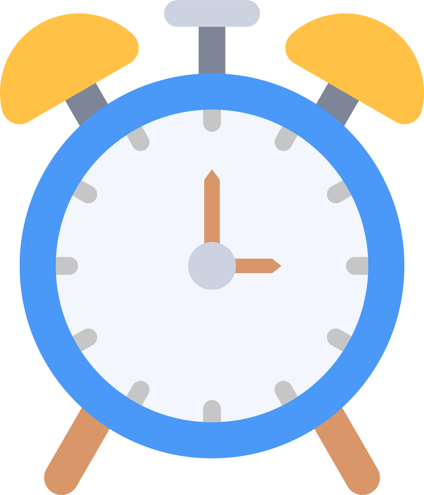

<h1 align="center">
     [Project Name]
</h1>

<p align="center">
    <i>A simple Alarm with Custom Tkinter</i>
</p>

<p align="center">
  <!-- Mandatory Badges -->
  <a href="#getting-started"></a>
   
  <!-- Recommended Badges -->
  
  
  
</p>

<p align="center">
  
</p><!--OPTIONAL BUT RECOMMENDED-->

## 📖 About

A sleek, modern GUI-based Alarm Clock application built using Python. This app provides a user-friendly interface for setting time-specific alerts, featuring a real-time digital clock display and high-quality audio notifications.

---

## ✨ Features

- Dynamic GUI
- Real-Time Monitoring
- Reliable Audio Alerts
- Input Validation

---

## 🚀 Getting Started

### Prerequisites

Before you begin, ensure you have the following installed:

- Python 3.11 and lower
- pip (Python package manager)

### Installation

1. **Clone the repository**

```bash
git clone https://github.com/sanath-kumar-s/Python-beginner-projects.git
cd Alarm
```

2. **Install dependencies**

```bash
pip install -r requirements.txt
```

3. **Run a project**

```bash
cd [your-project-folder-name]
python main.py
```

---

## 📂 Project Structure

```
Alarm/
│
├── main.py
├── alarm.mp3
├── README.md
├── requirments.txt
```

---

## 🛠️ Technologies Used

- **Python** – Primary programming language
- **CustomTkinter** – For the UI
- **Pygame** – For playing the alarm audio

---

## 📋 Requirements

Common dependencies across projects:

```txt
customtkinter==5.2.2
pygame==2.6.1
```

_Note: Individual projects may have additional requirements. Check each project's `requirements.txt` file._

---

## 📝 License

This project is licensed under the MIT License - see the [LICENSE](LICENSE) file for details.

---

## 👥 Contributors

Sanath Kumar S

---

## 📞 Contact & Support

- **Maintainer:** Sanath Kumar S
- **Email:** sanathkumar5638@gmail.com
- **Issues:** [Report bugs or request features](https://github.com/sanath-kumar-s/Python-beginner-projects/issues)
- **Discussions:** [Join the conversation](https://github.com/sanath-kumar-s/Python-beginner-projects/discussions)

---

## 🌟 Show Your Support

If you find this project helpful, please give it a ⭐️ on GitHub!

---

## 🤝 Contributing

We welcome contributions from developers of all skill levels! Here's how you can contribute:

For detailed guidelines, please read [CONTRIBUTING.md](CONTRIBUTING.md)

---

## 📚 Learning Resources

New to programming? Check out these resources:

- [Python Official Documentation](https://docs.python.org/)
- [GitHub Guides](https://guides.github.com/)
- [How to Contribute to Open Source](https://opensource.guide/how-to-contribute/)

---

## 🗺️ Roadmap

- [ ] Add 10 beginner projects
- [ ] Add 5 intermediate projects
- [ ] Create video tutorials
- [ ] Add project templates
- [ ] Improve documentation

---

<p align="center">
  Made with ❤️ by the open source community
</p>
