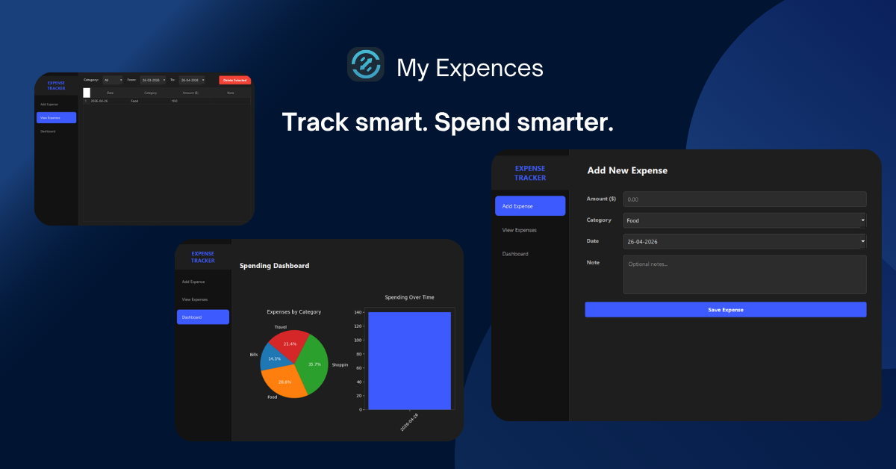

<h1 align="center">
     ExpenseTracker
</h1>

<p align="center">
    <i>A sleek, premium desktop application for effortless expense management and financial insights.</i>
</p>

<p align="center">
  <!-- Mandatory Badges -->
  <a href="#getting-started"></a>
   
  <!-- Recommended Badges -->
  
  
  
</p>

<p align="center">
  
</p><!--OPTIONAL BUT RECOMMENDED-->

## 📖 About

**ExpenseTracker** is a modular desktop application designed to simplify personal finance management. Built with Python and the modern PySide6 framework, it provides a comprehensive suite of tools to log, categorize, and visualize your spending.

The project follows a clean architectural pattern, separating UI components from business logic and database operations, making it highly maintainable and easy to extend.

---

## ✨ Features

- **📊 Visual Analytics**: Interactive pie charts for category distribution and bar charts for spending trends over time using Matplotlib.
- **📝 Easy Logging**: Streamlined interface to add expenses with custom amounts, categories, dates, and detailed notes.
- **🎨 Premium Dark UI**: A modern, glassmorphic design system applied via custom QSS for a premium user experience.
- **🗄️ Robust Persistence**: Reliable data storage using SQLite, ensuring your financial data stays local and secure.
- **🧩 Modular Design**: Organized codebase into logical subdirectories (ui, logic, database) for better scalability.

---

## 🚀 Getting Started

### Prerequisites

Before you begin, ensure you have the following installed:

- Python 3.10 or higher
- pip (Python package manager)
- Git

### Installation

1. **Clone the repository**

```bash
git clone https://github.com/sanath-kumar-s/Python-beginner-projects/ExpenceTracker
cd ExpenceTracker
```

2. **Install dependencies**

```bash
pip install -r requirements.txt
```

3. **Run the application**

```bash
python main.py
```

---

## 📂 Project Structure

```
ExpenceTracker/
│
├── assets/             # UI styles (QSS) and image assets
├── database/           # SQLite schema and database handling logic
├── logic/              # Business logic and controllers
├── ui/                 # PySide6 views and main window components
│
├── expenses.db         # Local SQLite database (generated on first run)
├── main.py             # Application entry point
├── requirements.txt    # Project dependencies
└── README.md           # Project documentation
```

---

## 🛠️ Technologies Used

- **Python** – Core programming language.
- **PySide6** – Modern GUI framework for the desktop experience.
- **Matplotlib** – Powerful library for generating interactive spending charts.
- **SQLite** – Lightweight, file-based database for secure local storage.

---

## 📋 Requirements

The project relies on the following libraries:

```txt
matplotlib==3.10.9
pyside6==6.11.0
pyside6_addons==6.11.0
pyside6_essentials==6.11.0
```

---

## 📝 License

This project is licensed under the MIT License - see the [LICENSE](LICENSE) file for details.

---

## 👥 Contributors

- **Sanath Kumar S** - Lead Developer

---

## 🌟 Show Your Support

If you find this project helpful, please give it a ⭐️ on GitHub!

---

## 🤝 Contributing

We welcome contributions! Whether it's fixing bugs, adding features, or improving documentation:

1. Fork the Project
2. Create your Feature Branch (`git checkout -b feature/AmazingFeature`)
3. Commit your Changes (`git commit -m 'Add some AmazingFeature'`)
4. Push to the Branch (`git push origin feature/AmazingFeature`)
5. Open a Pull Request

---

## 🗺️ Roadmap

- [ ] Export reports to PDF/CSV
- [ ] Support for multiple currencies
- [ ] User authentication and profiles
- [ ] Budgeting and alerts for overspending
- [ ] Mobile companion app integration

---

<p align="center">
  Made with ❤️ for better financial clarity
</p>
