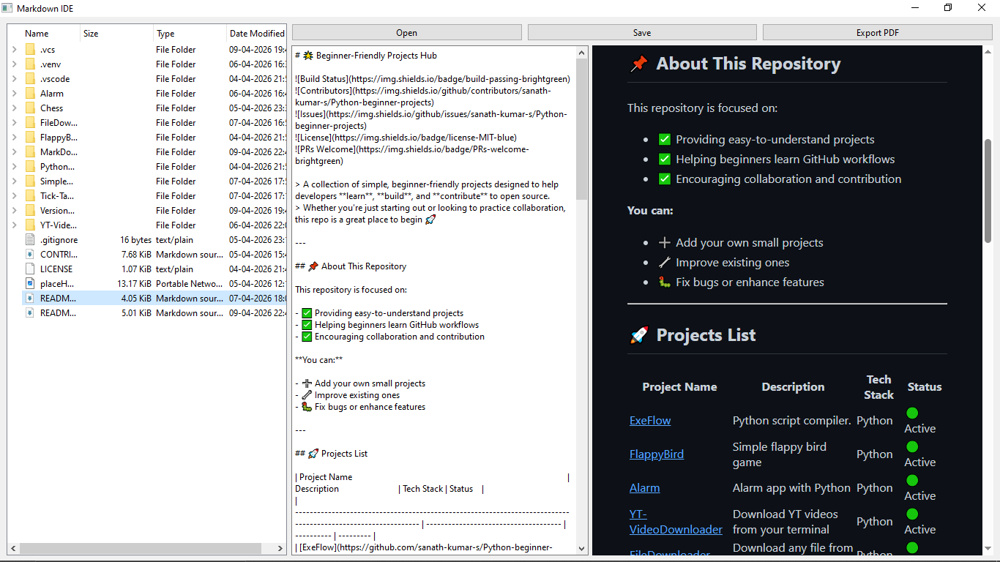

<h1 align="center">
     Markdown IDE
</h1>

<p align="center">
    <i>Offline editor for Markdown files</i>
</p>

<p align="center">
  <!-- Mandatory Badges -->
  <a href="#getting-started"></a>
   
  <!-- Recommended Badges -->
  
  
  
</p>

<p align="center">
  
</p><!--OPTIONAL BUT RECOMMENDED-->

## 📖 About

Markdown IDE is a desktop application designed to provide a GitHub-like Markdown reading and editing experience locally.

It combines a live preview engine, file explorer, and offline rendering system to give you a smooth and distraction-free workflow for writing Markdown.

> [Note]
> This is just a simple project there might be bugs and missing features

---

## ✨ Features

- ⚡ Live Preview (Split Editor + Viewer)
- 📂 Sidebar File Explorer
- 🖱️ Drag & Drop .md Files
- 🧾 Export to PDF
- 🎨 GitHub-like Dark Theme (Offline)
- 🧠 Markdown Extensions Support
- Code blocks
- Tables
- Syntax highlighting
- ⚠️ Custom Alerts Support
  `>[!NOTE]` `>[!WARNING]` `>[!TIP]` `>[!DANGER]`
- 🖼️ Local Image Rendering Support
- 📦 Fully Offline (No CDN dependency)

---

## 🚀 Getting Started

### Prerequisites

Before you begin, ensure you have the following installed:

- Python 3.10 or higher
- pip (Python package manager)
- Git

### Installation

1. **Clone the repository**

```bash
git clone https://github.com/your-username/markdown-ide.git
cd markdown-ide
pip install -r requirements.txt
```

2. **Install dependencies**

```bash
pip install -r requirements.txt
```

3. **Run a project**

```bash
cd MarkDownIDE
python main.py
```

---

## 🛠️ Technologies Used

- Python – Core language
- PyQt6 – GUI framework
- Qt WebEngine – Chromium-based rendering
- Markdown (Python) – Markdown parsing
- Pygments – Syntax highlighting

---

## 📋 Requirements

Common dependencies across projects:

```txt
PyQt6
PyQt6-WebEngine
markdown
pygments
```

_Note: Individual projects may have additional requirements. Check each project's `requirements.txt` file._

---

## 📝 License

This project is licensed under the MIT License - see the [LICENSE](LICENSE) file for details.

---

## 👥 Contributors

Sanath Kumar S

---

## 📞 Contact & Support<!--Include this only if you know what you are doing and this is not mandatory. Delete this section if not required-->

- **Maintainer:** Sanath Kumar S
- **Email:** sanathkumar5638@gmail.com
- **Issues:** [Report bugs or request features](https://github.com/sanath-kumar-s/Python-beginner-projects/issues)
- **Discussions:** [Join the conversation](https://github.com/sanath-kumar-s/Python-beginner-projects/discussions)

---

## 🌟 Show Your Support

If you find this project helpful, please give it a ⭐️ on GitHub!

---

## 🤝 Contributing

We welcome contributions from developers of all skill levels! Here's how you can contribute:

For detailed guidelines, please read [CONTRIBUTING.md](CONTRIBUTING.md)

---

## 📚 Learning Resources

New to programming? Check out these resources:

- [Python Official Documentation](https://docs.python.org/)
- [GitHub Guides](https://guides.github.com/)
- [How to Contribute to Open Source](https://opensource.guide/how-to-contribute/)

---

## 🗺️ Roadmap

- [ ] Add 10 beginner projects
- [ ] Add 5 intermediate projects
- [ ] Create video tutorials
- [ ] Add project templates
- [ ] Improve documentation

---

<p align="center">
  Made with ❤️ by the open source community
</p>
